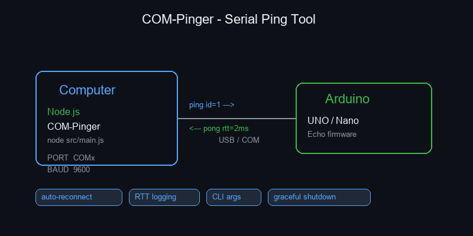

# COM-Pinger

<p align="center">
  
</p>

**COM-Pinger** — утилита для проверки связи между компьютером и Arduino через COM-порт. Отправляет периодические `ping`-сообщения и измеряет время отклика (RTT).

## Как это работает

```
Computer (Node.js)          Arduino
┌──────────────┐           ┌──────────────┐
│   COM-Pinger │──ping──►  │    Echo      │
│              │◄──pong──  │   firmware   │
└──────────────x           └──────────────┘
      USB / COM
```

1. **Node.js** открывает COM-порт и отправляет `ping <id> <timestamp>` каждую секунду
2. **Arduino** принимает строку и отправляет её обратно (echo)
3. **Node.js** принимает ответ, вычисляет RTT (round-trip time) и логирует

## Возможности

- **Измерение RTT** — точное время пинг-понга в миллисекундах
- **Авто-реконнект** — автоматическое переподключение при обрыве связи
- **Гибкая настройка** — порт, скорость, интервал через аргументы CLI
- **Логирование в файл** — опциональный дамп всех пингов в лог-файл
- **Graceful shutdown** — корректное завершение по Ctrl+C

## Установка

```bash
git clone https://github.com/RuslanStrogov/com-pinger.git
cd com-pinger
npm install
```

## Использование

```bash
# Запуск с параметрами по умолчанию (COM8, 9600 baud, 1000ms)
node src/main.js

# Свои параметры
node src/main.js --port COM3 --baud 115200 --interval 500

# С записью в лог-файл
node src/main.js --port COM3 --log ping.log

# Все параметры
node src/main.js --port COM3 --baud 9600 --interval 1000 --reconnect 3000 --log ping.log
```

### Аргументы

| Флаг | По умолчанию | Описание |
|------|-------------|----------|
| `--port` | `COM8` | COM-порт |
| `--baud` | `9600` | Скорость (baud rate) |
| `--interval` | `1000` | Интервал пинга (мс) |
| `--reconnect` | `3000` | Задержка реконнекта (мс) |
| `--log` | — | Путь к лог-файлу (опционально) |

## Прошивка Arduino

Загрузите скетч из `platformio-com-pinger-arduino-uno/` в Arduino UNO/Nano:

```bash
cd platformio-com-pinger-arduino-uno
pio run --target upload
```

Или скопируйте содержимое `src/main.cpp` в Arduino IDE.

## Пример вывода

```
[2026-06-20T05:23:01.000Z] COM-Pinger starting
[2026-06-20T05:23:01.001Z]   port=COM8 baud=9600 interval=1000ms reconnect=3000ms
[2026-06-20T05:23:01.002Z] Opening COM8 @ 9600 baud …
[2026-06-20T05:23:01.050Z] Port opened
[2026-06-20T05:23:01.051Z] Ping interval: 1000 ms
[2026-06-20T05:23:02.052Z] pong id=1 rtt=3ms
[2026-06-20T05:23:03.052Z] pong id=2 rtt=2ms
[2026-06-20T05:23:04.052Z] pong id=3 rtt=2ms
```

## Структура проекта

```
com-pinger/
├── src/
│   └── main.js          # Основной скрипт (Node.js)
├── platformio-com-pinger-arduino-uno/
│   ├── src/main.cpp     # Прошивка Arduino (echo)
│   └── platformio.ini   # Конфигурация PlatformIO
├── assets/
│   └── schematic.png    # Схема для README
├── package.json
└── README.md
```

## Зависимости

- [serialport](https://serialport.io/) — работа с COM-портами из Node.js
- Arduino UNO/Nano (или любой совместимый)

## Лицензия

MIT
